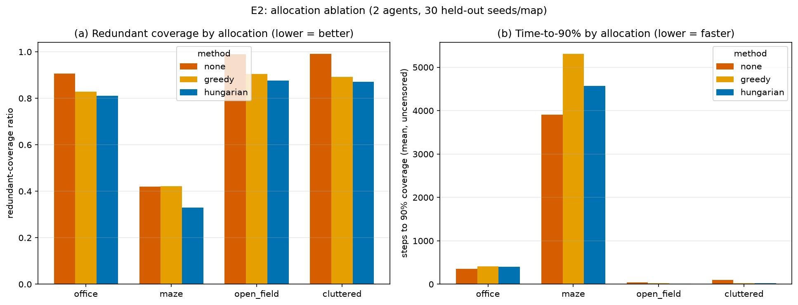
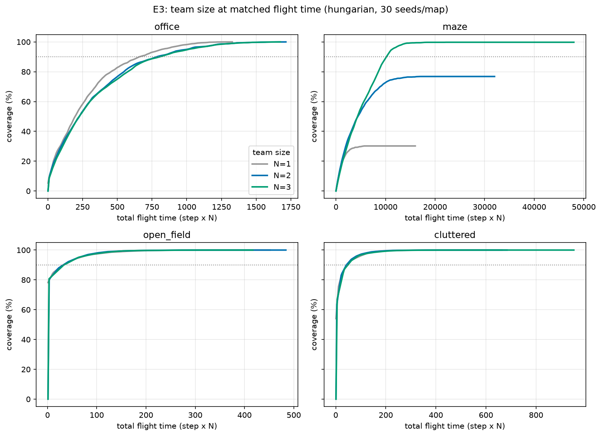
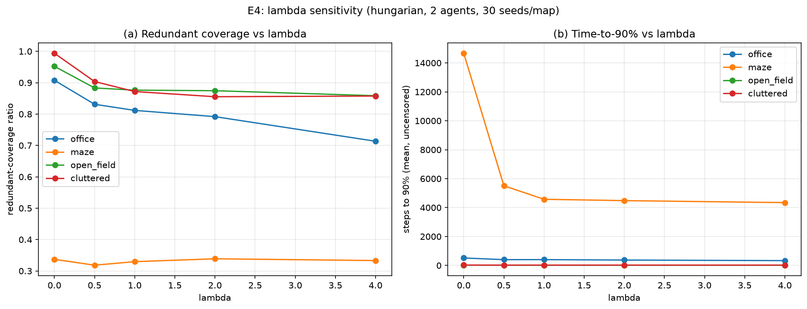

# Phase 4 Results — Coordinated Two-Agent Exploration (E2–E4)

**Primary contribution.** Does *coordinating* which agent explores which frontier
measurably beat letting each agent independently chase its nearest frontier?

Three experiments, all on the frozen 30-seeds-per-map held-out set, A\* planner,
96×96 grid (24 m), `max_steps = 16000`, agents launched from a **shared base**
(the `base` start layout: the *n* free cells nearest the map centre). Raw data:
`results/raw/e{2,3,4}_summary.csv` (+ `_steps.csv`); figures:
`results/figures/e{2,3,4}_*.png`. Every run is fully determined by
`(map_kind, seed, size, method, n_agents, lambda)` and reproduces on re-run.

> **Headline.** Coordination reduces redundant coverage on **every** map and is
> also **faster** on the two open maps. But it is **not free**: on `office` it
> trades a little speed for less overlap, and at the default `lambda = 1` it
> **hurts on `maze`** — a genuine negative result, explained and largely fixed by
> E4. We report it straight rather than tuning it away.

---

## Baseline B2 confirmed (CLAUDE.md Phase 4.3)

Before comparing, we confirmed the uncoordinated failure mode exists. With a
shared base, the `none` baseline (each agent independently takes its nearest
frontier) drives both agents to the *same* frontier almost every round, so they
move together and re-observe the same cells: redundant-coverage ratio **0.99** on
`open_field`/`cluttered`, **0.91** on `office`. That is the waste coordination
must remove.

---

## E2 — Allocation ablation (N = 2)

Mean over 30 held-out seeds. **Redundant ratio** = fraction of observed cells
seen by >1 agent (lower = better coordination, the key §5 metric).
**ttc90** = mean steps to 90 % coverage over *uncensored* runs (n = how many of
30 reached 90 %).

| Map | Method | Redundant ↓ | Final cov % | ttc90 (n) | Total path (m) |
|---|---|---|---|---|---|
| **office** | none | 0.907 | 100.0 | 352 (30) | 293 |
| | greedy | 0.828 | 100.0 | 407 (30) | 407 |
| | **hungarian** | **0.812** | 100.0 | 402 (30) | 402 |
| **open_field** | none | 0.990 | 100.0 | 41 (30) | 113 |
| | greedy | 0.905 | 100.0 | 18 (30) | 85 |
| | **hungarian** | **0.876** | 100.0 | **17 (30)** | **78** |
| **cluttered** | none | 0.992 | 100.0 | 99 (30) | 179 |
| | greedy | 0.892 | 100.0 | 23 (30) | 139 |
| | **hungarian** | **0.872** | 100.0 | **22 (30)** | **130** |
| **maze** | none | 0.420 | **98.2** | 3910 (29) | 2694 |
| | greedy | 0.421 | 84.2 | 5313 (20) | 4829 |
| | hungarian | 0.330 | **76.8** | 4574 (16) | 5260 |

**Overall (all maps):** redundant ratio none **0.827** → greedy 0.761 →
hungarian **0.722**; Hungarian also has the lowest mean ttc90.

### Reading E2

- **Open maps (`open_field`, `cluttered`) — unambiguous win.** Coordination cuts
  redundancy *and* reaches 90 % ~2–4× faster with ~30 % less flying. Agents split
  to opposite frontiers instead of shadowing each other.
- **`office` — a real trade-off.** Coordination cuts redundancy (0.907→0.812) but
  is ~14 % *slower* (352→402 steps) and flies further. Splitting up in a
  room-and-corridor layout costs travel that a together-moving pair saves.
- **`maze` — coordination *hurts* at λ = 1 (negative result).** Coverage falls
  from 98 % (uncoordinated) to 77 % (Hungarian), and only 16/30 runs even reach
  90 %. Cause: in width-1 corridors the allocator sends the two agents to
  far-apart frontiers; the long detours strand them in dead-end pockets that get
  blacklisted before the map is finished. Uncoordinated agents, by moving
  together, sweep each corridor to its end and finish more of the map. **E4 shows
  this is a λ problem, not a coordination problem** — see below.
- **greedy vs hungarian:** Hungarian is consistently a little better on redundancy
  and time, but the gap is small — for 2 agents the optimal assignment and the
  greedy one usually coincide. The value of Hungarian will grow with team size.

---

## E3 — Team size at matched flight time (Hungarian, N = 1, 2, 3)

Extra agents obviously finish in fewer *wall-clock steps*; the honest question is
whether they help per unit of **total flight effort** (steps × N). "Flight" below
is `ttc90_steps × N`.

| Map | N | Final cov % | ttc90 steps | ttc90 **flight** | Redundant |
|---|---|---|---|---|---|
| **office** | 1 | 100.0 | 662 | 662 | 0.000 |
| | 2 | 100.0 | 402 | 804 | 0.812 |
| | 3 | 100.0 | 268 | 803 | 0.827 |
| **open_field** | 1 | 100.0 | 35 | 35 | 0.000 |
| | 2 | 100.0 | 17 | 35 | 0.876 |
| | 3 | 100.0 | 12 | 36 | 0.919 |
| **cluttered** | 1 | 100.0 | 46 | 46 | 0.000 |
| | 2 | 100.0 | 22 | 44 | 0.872 |
| | 3 | 100.0 | 16 | 49 | 0.946 |
| **maze** | 1 | **30.2** | — (0/30) | — | 0.000 |
| | 2 | 76.8 | 4574 | 9147 | 0.330 |
| | 3 | **99.8** | 3342 | 10027 | 0.481 |

### Reading E3

- **N = 1 is the regression anchor:** redundant ratio is exactly 0.000 (a lone
  agent cannot double-observe), and coverage matches the Phase 2 single agent.
- **Near-linear wall-clock speed-up, no free energy.** On open maps, ttc90 in
  *steps* roughly halves/thirds with N, but ttc90 in *flight* is essentially flat
  (open_field ≈ 35 for all N; office 662→804→803). More drones finish sooner but
  spend about the same total distance — the expected result, not superlinear.
- **`maze` is where extra agents genuinely matter — for completeness, not speed.**
  A single agent explores only 30 % (it gets stuck in one sub-tree); N = 2 reaches
  77 %, N = 3 reaches **99.8 %**. Here the payoff of a team is *robustness of
  coverage*, at the price of more total flight.

---

## E4 — λ sensitivity (Hungarian, N = 2)

Score = `utility − λ·cost`. λ = 0 is pure information-gain (ignore travel); large
λ favours nearby frontiers. Mean redundant ratio / coverage / ttc90 (n) per map:

| Map | λ=0 | λ=0.5 | λ=1 | λ=2 | λ=4 |
|---|---|---|---|---|---|
| **office** redund | 0.908 | 0.831 | 0.812 | 0.792 | **0.713** |
| office ttc90 | 516 | 400 | 402 | 372 | **334** |
| **open_field** redund | 0.952 | 0.883 | 0.876 | 0.874 | **0.858** |
| **cluttered** redund | 0.994 | 0.904 | 0.872 | 0.855 | 0.857 |
| **maze** cov % | 59.1 | 75.3 | 76.8 | 91.0 | **91.9** |
| maze reached-90 (of 30) | 2 | 12 | 16 | 23 | 23 |

### Reading E4

- **λ = 0 (pure information gain) is the worst setting everywhere.** Ignoring
  travel cost sends both agents to whichever frontier looks most informative —
  often the same distant one — maximising overlap and, on `maze`, stranding them
  (only 2/30 runs finish).
- **Higher λ monotonically lowers redundancy** on the open maps and steadily
  speeds up `office`.
- **λ fixes the `maze` failure.** Weighting cost keeps agents on *nearby
  reachable* frontiers instead of chasing far ones, lifting maze coverage from
  59 % (λ=0) to **92 %** (λ≥2). This is the direct explanation of E2's maze
  result: the default λ = 1 was simply too low for thin-corridor maps.
- **Recommended operating point: λ ≈ 2.** It gives most of the redundancy
  reduction on open maps and recovers maze coverage, without a downside on the
  others. (λ = 1 was the pre-registered default used in E2/E3; we report λ = 2 as
  a *finding*, not a retro-tuned headline — E2/E3 numbers are left at λ = 1.)

---

## Honest summary

- **Does coordination beat uncoordinated exploration?** Yes on redundant coverage
  (the metric the phase is about) — on all four maps, and by a clear margin on the
  three non-maze maps — and yes on *speed* on the two open maps. This satisfies the
  Phase 4 acceptance criterion (a meaningful reduction in redundant coverage).
- **Where it doesn't help:** on `office` coordination costs some travel, and at the
  default λ it degrades `maze` completion. Both are consequences of splitting a
  team inside tight corridors; E4 shows a higher λ recovers the maze case.
- **Team size:** adds wall-clock speed at ~proportional total-flight cost on open
  maps, and buys coverage *completeness* on mazes (where one agent fails outright).
- **Method:** Hungarian ≥ greedy ≥ none throughout, though greedy is close at N = 2.

### Threats to validity / limitations

- Single planner (A\*) and one grid scale (96²). Conclusions on *coordination* are
  expected to hold across scale but time-to-coverage magnitudes are not.
- Shared-base start maximises the coordination-relevant overlap; a `spread` start
  (implemented, not swept) would show a smaller—but still positive—gap.
- ttc90 means exclude censored runs, so on `maze` the coordinated ttc90 is computed
  over the *subset* that finished — coverage %, not ttc90, is the fair maze metric.

**Reproduce:** `python -m scripts.run_e2 && python -m scripts.run_e3 &&
python -m scripts.run_e4 && python -m scripts.plot_phase4` (≈ 90 min, 20 workers).
