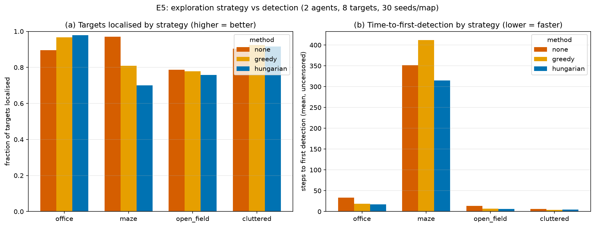

# Phase 5 Results — Exploration Strategy vs Detection (E5)

**Secondary contribution.** The drones now explore *and* record what they find:
`M = 8` hidden targets per map, a simulated detector (forward camera cone +
line-of-sight, `recall = 0.9`, localisation noise `σ = 0.3 m`), and a
deduplicating shared `TargetRegister`. **Question E5:** does *how* the team
explores change *what it finds*?

Because detection is a decoupled layer that never feeds back into planning, any
difference in detection outcomes comes purely from **where each strategy sends the
agents and how fast/completely it covers ground**. Setup mirrors E2: A\* planner,
2 agents, shared base, 96×96 grid, 4 map kinds × 30 held-out seeds, allocation ∈
{none, greedy, hungarian}, λ = 1. Metrics per §5: time-to-first-detection,
fraction of targets localised (within 1 m), localisation error. Raw:
`results/raw/e5_summary.csv`; figure: `results/figures/e5_strategy_vs_detection.png`.

> **Detector note.** The learned detector (real dataset, mAP@50, small-object
> subset) is a separate teammate deliverable ("half A"). It plugs into the same
> `Detector.detect()` interface used here, so these simulator-side results stand
> on their own and will not change when the real model is dropped in.

---

## Headline numbers (mean over 30 held-out seeds)

`ttfd` = mean steps to the first true-positive registration (uncensored, n of 30
that ever localised a target). `frac` = fraction of the 8 targets localised.
`locerr` = mean localisation error (m). `FP` = false positives per run.

| Map | Method | frac ↑ | ttfd ↓ (n) | locerr (m) | FP |
|---|---|---|---|---|---|
| **office** | none | 0.896 | 33 (30) | 0.136 | 1.03 |
| | greedy | 0.967 | 19 (30) | 0.133 | 1.27 |
| | **hungarian** | **0.979** | **17 (30)** | 0.125 | 1.23 |
| **cluttered** | none | 0.904 | 6 (30) | 0.128 | 1.33 |
| | greedy | **0.925** | **4 (30)** | 0.138 | 1.07 |
| | hungarian | 0.917 | 5 (30) | 0.128 | 1.00 |
| **open_field** | none | **0.787** | 13 (30) | 0.120 | 0.93 |
| | greedy | 0.779 | 7 (30) | 0.152 | 1.03 |
| | hungarian | 0.758 | **6 (30)** | 0.151 | 1.03 |
| **maze** | **none** | **0.971** | 351 (30) | 0.204 | 1.03 |
| | greedy | 0.808 | 412 (29) | 0.176 | 0.93 |
| | hungarian | 0.700 | **315 (29)** | 0.228 | 0.83 |

**Overall:** hungarian finds the first target **fastest** (ttfd 84 vs none 101)
but localises the **fewest** on average (frac 0.839 vs none 0.890) — because the
average is dragged down by maze.

---

## What E5 shows

**1. Exploration strategy *does* affect detection — through coverage speed and
completeness, exactly as expected for a decoupled detector.**

- **Time-to-first-detection tracks coverage speed.** On the maps where
  coordination covers ground faster (office 33→17, open_field 13→6, cluttered
  6→5), it also finds the *first* target faster. Spreading agents means new ground
  is seen sooner, and detection rides along.
- **Fraction localised tracks coverage *completeness*.** On `office`, coordination
  explores more rooms and localises more targets (0.90→0.98). On `maze`, the λ = 1
  coordination failure documented in E2/E4 (agents split to far frontiers and fail
  to finish) means whole corridors go unexplored — so coordinated runs *miss
  targets in them*: frac drops 0.97→0.70. The uncoordinated team, sweeping
  corridors together, finds nearly all.

**2. Localisation error is strategy-independent (~0.12–0.23 m everywhere).** It is
set by the detector's noise, not by how the team moves — as it should be. All
strategies localise well within the 1 m tolerance.

**3. False positives (~1/run) come from over-segmentation**, not the strategy: a
target's noisy detections occasionally seed two register entries when the first
two sightings land > `dedup_radius` apart. Roughly constant across methods.

---

## Honest takeaways

- **Detection outcomes are downstream of exploration quality.** There is no free
  lunch: a strategy finds targets faster/more-completely exactly where it covers
  ground faster/more-completely. This validates the decoupled design — and means
  the Phase 4 coverage story (coordination wins on open/room maps, the λ = 1 maze
  failure) reappears verbatim in the detection metrics.
- **The `maze` result is the same negative finding as Phase 4, seen through a new
  lens.** E4 already showed λ ≥ 2 recovers maze *coverage*; by the coverage↔frac
  link above, it would recover maze *detection* too. We did not re-run E5 at λ = 2
  (E5 is pre-registered at the λ = 1 default) — we flag it as the expected fix
  rather than retro-tuning the headline.
- **The forward camera cone is a real limitation on `open_field`.** Even
  uncoordinated, only ~79 % of open-field targets are localised: agents crossing
  wide space see straight ahead and miss targets off to the side. A wider FOV or a
  nadir (downward) footprint would raise this — a clean future-work lever, and a
  parameter already exposed in config.

### Limitations

- Simulated detector, not a trained model: recall/noise/FOV are configured, not
  measured. Absolute frac/ttfd numbers will shift with the real model; the
  *relative* strategy comparison should hold.
- Ground-truth pose (no SLAM, per project scope): localisation error here is
  detector noise only, not pose drift.
- λ = 1 throughout (pre-registered); maze detection inherits the λ sensitivity of
  E4.

**Reproduce:** `python -m scripts.run_e5 && python -m scripts.plot_phase4`
(≈ 25 min, 20 workers). Live view: `python -m scripts.demo_phase5 --map office`
(green squares = true targets, red × = registered estimates).
